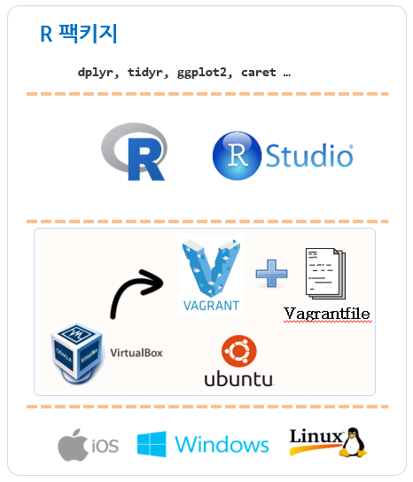

## 데이터 과학을 위한 개발환경

윈도우 환경에서 RStudio를 비롯한 개발환경을 구축하려면, 먼저 로컬 클라이언트 컴퓨터의 환경을 다음과 같이 준비하고 나서, [가상상자(VirtualBox)](https://www.virtualbox.org/)와 [부랑자(Vagrant)](https://www.vagrantup.com/)를 설치한다.

> ### 1. 윈도우 환경 (Windows 7) [^reason]
> 
> * CPU의 가상화 기능을 활성화 한다.
> * 마이크로소프트 비쥬얼 C++ 201X 재배포 가능 패키지 (Microsoft Visual C++ 2010 Redistributable Package)를 설치한다.
>
> * 컴퓨터를 부팅하고 나서 **F12**키를 누르면 BIOS로 진입한다. `Startup Device Menu > Enter Setup`을 선택한다. 
>   `Lenovo BIOS Setup Utility > Advanced > CPU Setup > Intel (R) Virtualization Technology` 이것을 **[Enabled]** 시킨다.

> ### 2. 사전 설치 소프트웨어 
> 
> * [가상상자(VirtualBox)](https://www.virtualbox.org/wiki/Downloads)
> * [부랑자(Vagrant)](https://www.vagrantup.com/downloads.html)

[^reason]: 윈도우 환경에서 CPU 가상화 기능을 활성화하고 비쥬얼 C++ 재배포 가능 패키지 vcredist_x86.exe, vcredist_x64.exe 를 설치가 필요한 이유는 가상상자와 부랑자의 가상화기능을 사용하기 위한 전제조건이 된다. 

### 데이터 과학을 위한 분석 툴체인

데이터 과학을 위한 분석 툴체인과 같이 구성된다.

* [R 코어엔진](https://cran.r-project.org/): R 코어 엔진 3.3.1 버젼('16.06.21) 
* [RStudio](https://www.rstudio.com/): R 통합개발환경(IDE)
* [RStudio Server](https://www.rstudio.com/products/RStudio/#Server): R 통합개발환경(IDE) 웹서버 버젼
* [R Shiny](http://shiny.rstudio.com/): R 개발제품 웹배포 환경

### R 분석 팩키지

* `dplyr`, `tidyr`, `ggplot2`, `caret` 등

### 참조 웹사이트

1. [Stats on Ubuntu: getting an up-to-date R environment](http://blog.terminal.com/getting-an-up-to-date-r-and-rstudio-installation-on-ubuntu/)